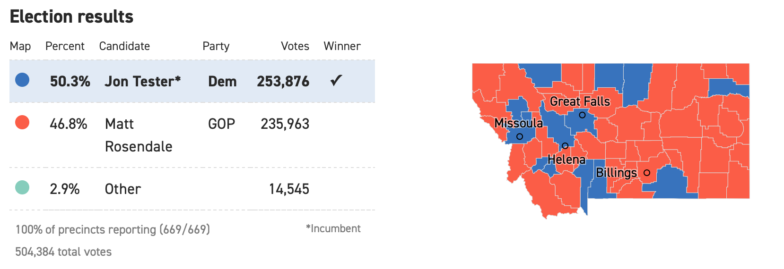

```{r setup, include=FALSE}
knitr::opts_chunk$set(echo = TRUE)
knitr::opts_chunk$set(message = FALSE)
library(dplyr)
library(ggplot2)
library(maps)
library(maptools)
library(sf)
library(spdep)
library(readr)
#devtools::install_github("UrbanInstitute/urbnmapr")
library(urbnmapr)
library(usmap)
library(arm)
```

Recall the motivating image, 

```{r, out.width = "95%", echo = F, fig.align = 'center', fig.cap='source: https://www.politico.com/election-results/2018/montana/'}
 
```

using the following dataset

```{r}
Tester <- read_csv('Tester_Results.csv')
Tester <- Tester %>% 
  mutate(Tester_Prop = TESTER / (TESTER + ROSENDALE + BRECKENRIDGE),
         county_fips = as.character(FIPS))
```

recreate the image. Recall `urbnmapr::counties` has a shape file with county level boundaries.


## Adjacency Matrix
Follow the code below to create an adjacency matrix for Montana. 

```{r, eval = T, echo = T}
MT.counties <- map('county', 'montana', fill = T, plot = F)
#map('county', 'montana')
county.ID <- sapply(strsplit(MT.counties$names, ','), 
                    function(x) x[2])
mt.poly <- map2SpatialPolygons(MT.counties, IDs = county.ID)

#drop Yellowstone National Park
mt.poly.noYNP <- mt.poly[1:56,]
mt.nb.noYNP <- poly2nb(mt.poly.noYNP)
mt.listw <- nb2listw(mt.nb.noYNP, style = 'W')
mt.adj.mat <- nb2mat(mt.nb.noYNP)
```


## Moran's I / Geary's C

Using the Tester - Rosendale election results and the adjacency matrix compute and interpret Moran's I and Geary's C with the proportion voting for Tester.

```{r, echo = T, eval = T}
Tester <- Tester %>% mutate(COUNTY = tolower(COUNTY))
Tester$COUNTY[Tester$COUNTY == 'lewis & clark'] <- 'lewis and clark'
comb <- tibble(COUNTY = rownames(mt.adj.mat)) %>% left_join(Tester, by = "COUNTY")

```


## Now consider some covariates to explain the response

Consider a linear model with county population

```{r, echo = T}
library(usmap)
usmap::countypop
```

```{r}
lm_dat <- Tester %>% 
  left_join(usmap::countypop %>% rename("county_fips" = fips), by = 'county_fips') %>%
  mutate(scale_pop = scale(pop_2015))

```

Extract the residuals create a choropleth and test for spatial structure.
