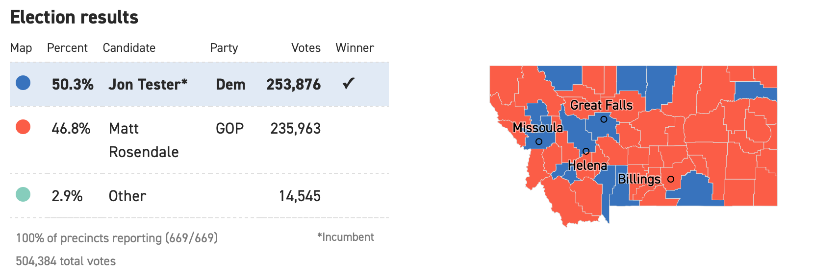

Areal Data Model Fitting
================

Recall the motivating image,

<div class="figure" style="text-align: center">


<p class="caption">
source: <https://www.politico.com/election-results/2018/montana/>
</p>

</div>

using the following dataset

``` r
Tester <- read_csv('Tester_Results.csv')
Tester <- Tester %>% 
  mutate(Tester_Prop = TESTER / (TESTER + ROSENDALE + BRECKENRIDGE),
         county_fips = as.character(FIPS))
```

recreate the image. Recall `urbnmapr::counties` has a shape file with
county level boundaries.

``` r
MT <- left_join(Tester, urbnmapr::counties, by = "county_fips") 

MT %>%
  ggplot(aes(long, lat, group = group, fill = Tester_Prop)) +
  geom_polygon(color = NA) +
  coord_map(projection = "mercator") +
  labs(fill = "Proportion  \nfor Tester") +
  theme_minimal() +
  scale_fill_gradient2(labels = scales::percent, 
                       guide = guide_colorbar(title.position = "top"),
                      low = 'red', high = 'blue', midpoint = .5)
```

<!-- -->

recreate the image.

## Adjacency Matrix

Follow the code below to create an adjacency matrix for Montana.

``` r
MT.counties <- map('county', 'montana', fill = T, plot = F)
#map('county', 'montana')
county.ID <- sapply(strsplit(MT.counties$names, ','), 
                    function(x) x[2])
mt.poly <- map2SpatialPolygons(MT.counties, IDs = county.ID)

#drop Yellowstone National Park
mt.poly.noYNP <- mt.poly[1:56,]
mt.nb.noYNP <- poly2nb(mt.poly.noYNP)
mt.listw <- nb2listw(mt.nb.noYNP, style = 'W')
mt.adj.mat <- nb2mat(mt.nb.noYNP)
```

## Moran’s I / Geary’s C

Using the Tester - Rosendale election results and the adjacency matrix
compute and interpret Moran’s I and Geary’s C with the proportion voting
for Tester.

``` r
Tester <- Tester %>% mutate(COUNTY = tolower(COUNTY))
Tester$COUNTY[Tester$COUNTY == 'lewis & clark'] <- 'lewis and clark'
comb <- tibble(COUNTY = rownames(mt.adj.mat)) %>% left_join(Tester, by = "COUNTY")

moran.test(comb$Tester_Prop[1:56], mt.listw, alternative = 'two.sided')
```

    ## 
    ##  Moran I test under randomisation
    ## 
    ## data:  comb$Tester_Prop[1:56]  
    ## weights: mt.listw    
    ## 
    ## Moran I statistic standard deviate = 2.3986, p-value = 0.01646
    ## alternative hypothesis: two.sided
    ## sample estimates:
    ## Moran I statistic       Expectation          Variance 
    ##       0.182142483      -0.018181818       0.006975189

``` r
geary.test(comb$Tester_Prop[1:56], mt.listw, alternative = 'two.sided')
```

    ## 
    ##  Geary C test under randomisation
    ## 
    ## data:  comb$Tester_Prop[1:56] 
    ## weights: mt.listw 
    ## 
    ## Geary C statistic standard deviate = 2.3287, p-value = 0.01987
    ## alternative hypothesis: two.sided
    ## sample estimates:
    ## Geary C statistic       Expectation          Variance 
    ##       0.792537965       1.000000000       0.007936744

## Now consider some covariates to explain the response

Consider a linear model with county population

``` r
library(usmap)
usmap::countypop
```

    ## # A tibble: 3,142 x 4
    ##    fips  abbr  county          pop_2015
    ##    <chr> <chr> <chr>              <dbl>
    ##  1 01001 AL    Autauga County     55347
    ##  2 01003 AL    Baldwin County    203709
    ##  3 01005 AL    Barbour County     26489
    ##  4 01007 AL    Bibb County        22583
    ##  5 01009 AL    Blount County      57673
    ##  6 01011 AL    Bullock County     10696
    ##  7 01013 AL    Butler County      20154
    ##  8 01015 AL    Calhoun County    115620
    ##  9 01017 AL    Chambers County    34123
    ## 10 01019 AL    Cherokee County    25859
    ## # … with 3,132 more rows

``` r
lm_dat <- Tester %>% 
  left_join(usmap::countypop %>% rename("county_fips" = fips), by = 'county_fips') %>%
  mutate(scale_pop = scale(pop_2015))
```

``` r
pop_model <- lm(Tester_Prop ~  scale_pop, data = lm_dat)
display(pop_model)
```

    ## lm(formula = Tester_Prop ~ scale_pop, data = lm_dat)
    ##             coef.est coef.se
    ## (Intercept) 0.40     0.02   
    ## scale_pop   0.06     0.02   
    ## ---
    ## n = 56, k = 2
    ## residual sd = 0.13, R-Squared = 0.18

``` r
Tester$resids <- resid(pop_model)
```

Extract the residuals create a choropleth and test for spatial
structure.

``` r
MT <- left_join(Tester, urbnmapr::counties, by = "county_fips") 

MT %>%
  ggplot(aes(long, lat, group = group, fill = resids)) +
  geom_polygon(color = NA) +
  coord_map(projection = "mercator") +
  labs(fill = "Model Residuals") +
  theme_minimal() +
  scale_fill_gradient2(labels = scales::percent, 
                       guide = guide_colorbar(title.position = "top"),
                      low = 'red', high = 'blue', midpoint = 0)
```

<!-- -->

``` r
comb <- tibble(COUNTY = rownames(mt.adj.mat)) %>% left_join(Tester, by = "COUNTY")

moran.test(comb$resids[1:56], mt.listw, alternative = 'two.sided')
```

    ## 
    ##  Moran I test under randomisation
    ## 
    ## data:  comb$resids[1:56]  
    ## weights: mt.listw    
    ## 
    ## Moran I statistic standard deviate = 2.0525, p-value = 0.04012
    ## alternative hypothesis: two.sided
    ## sample estimates:
    ## Moran I statistic       Expectation          Variance 
    ##       0.152163624      -0.018181818       0.006888199

``` r
geary.test(comb$Tester_Prop[1:56], mt.listw, alternative = 'two.sided')
```

    ## 
    ##  Geary C test under randomisation
    ## 
    ## data:  comb$Tester_Prop[1:56] 
    ## weights: mt.listw 
    ## 
    ## Geary C statistic standard deviate = 2.3287, p-value = 0.01987
    ## alternative hypothesis: two.sided
    ## sample estimates:
    ## Geary C statistic       Expectation          Variance 
    ##       0.792537965       1.000000000       0.007936744
